<div align="center">
  
</div>

<div align="center">


<br/><br/>

<a href="https://www.linkedin.com/in/angel-114ba8395/"></a>
<a href="mailto:axangel1008@gmail.com"></a>
<a href="https://github.com/Angelbuilds10?tab=repositories"></a>
<a href="https://drive.google.com/drive/folders/12kaPMvMZK3GTcSB5_VLOwrF81O0yFumF?usp=sharing"></a>

<br/>


</div>


## 👩‍💻 &nbsp; About Me

<table>
<tr>
<td width="55%" valign="top">

I'm a **Mechatronics Engineering** undergrad at **Thapar Institute of Engineering and Technology**, working at the intersection of **intelligent systems, automation, and data science**.

I like the part of engineering where hardware meets data — where a model doesn't just score well, but actually changes the decision someone makes on the ground.

```
🔭  Building     →  AI + data science projects on real market data
🌱  Learning     →  Forecasting, MLOps, advanced visualization
🤝  Looking for  →  Collaborations in AI, analytics & automation
💬  Ask me about →  Python, SQL, LightGBM, Power BI
📫  Reach me     →  axangel1008@gmail.com
⚡  Fun fact     →  I'd rather ship one dashboard people use
                    than ten models nobody opens
```

</td>
<td width="45%" valign="top">

```python
class Angel:
    """Mechatronics × Data Science"""

    def __init__(self):
        self.school   = "Thapar Institute"
        self.degree   = "B.Tech Mechatronics"
        self.location = "Punjab, India 🇮🇳"

    @property
    def focus(self):
        return [
            "Artificial Intelligence",
            "Data Science",
            "Automation & Robotics",
        ]

    def philosophy(self):
        return (
            "Data is only useful "
            "when it reaches a decision."
        )
```

</td>
</tr>
</table>


## 🧰 &nbsp; Tech Stack

<div align="center">

**Languages & Core**


**Data Science & Machine Learning**


**Visualization & Data**


</div>


## 🚀 &nbsp; Featured Project

<div align="center">

### 🧅 &nbsp; Onion Market Intelligence

**An end-to-end pipeline that turns raw agricultural market data into profit decisions.**

<a href="https://github.com/Angelbuilds10/mangos-">
  
</a>

<br/><br/>

<table>
<tr>
<td align="center" width="25%"><h3>31,930+</h3><sub>MARKET RECORDS<br/>PROCESSED</sub></td>
<td align="center" width="25%"><h3>LightGBM</h3><sub>FORECASTING<br/>MODEL</sub></td>
<td align="center" width="25%"><h3>Power BI</h3><sub>INTERACTIVE<br/>DASHBOARDS</sub></td>
<td align="center" width="25%"><h3>SQL</h3><sub>SQLITE DATA<br/>WAREHOUSE</sub></td>
</tr>
</table>

</div>

**What it does**

- 📥 **Ingests & cleans** 31,930+ agricultural market records with Python, SQL and SQLite
- 📈 **Forecasts prices** using a LightGBM gradient-boosting model tuned on historical trends
- 📊 **Surfaces insight** through interactive dashboards built for profit optimization
- 🌐 **Ships a front end** so the analysis is usable by people who don't write code

<div align="center">

`Python` &nbsp;·&nbsp; `SQL` &nbsp;·&nbsp; `SQLite` &nbsp;·&nbsp; `Pandas` &nbsp;·&nbsp; `LightGBM` &nbsp;·&nbsp; `Power BI` &nbsp;·&nbsp; `HTML` &nbsp;·&nbsp; `CSS` &nbsp;·&nbsp; `JavaScript`

<a href="https://github.com/Angelbuilds10/mangos-"></a>

</div>


## 🎖️ &nbsp; Certifications & Achievements

<table>
<tr>
<td width="50%" valign="top">

### 📜 Certifications

| Program | Issuer |
|:--|:--|
| 🏔️ **Himshikhar 2026** — AI-Driven Analytics & Coding | IIT Mandi |
| 🐍 **Python for Data Science** | IBM SkillsBuild |
| 🤖 **Data Science & AI** — School Connect | IIT Madras |
| 🗣️ **PTE Academic** — Overall Score **74** | Pearson |

<div align="center">
<a href="https://drive.google.com/drive/folders/12kaPMvMZK3GTcSB5_VLOwrF81O0yFumF?usp=sharing"></a>
</div>

</td>
<td width="50%" valign="top">

### 🏆 Achievements

| Recognition | Where |
|:--|:--|
| 🥇 **Capstone Project Recognition Award** | IIT Mandi |
| 🌍 **High Commendation** | I.I.M.U.N. COP29 |
| 🎓 **Conditional Offer of Admission** | University of Sydney |

<br/>

<div align="center">


</div>

</td>
</tr>
</table>


## 📊 &nbsp; GitHub Analytics

<div align="center">


<br/>


<br/>


<br/>


<br/><br/>

<picture>
  <source media="(prefers-color-scheme: dark)" srcset="https://raw.githubusercontent.com/Angelbuilds10/Angelbuilds10/output/github-snake-dark.svg" />
  <source media="(prefers-color-scheme: light)" srcset="https://raw.githubusercontent.com/Angelbuilds10/Angelbuilds10/output/github-snake.svg" />
  
</picture>

</div>


## 🤝 &nbsp; Let's Build Something

<div align="center">

I'm always up for collaborating on **AI, data science, and automation** projects —<br/>
especially the kind where the output actually reaches someone who needs it.

<br/>

<a href="https://www.linkedin.com/in/angel-114ba8395/"></a>
<a href="mailto:axangel1008@gmail.com"></a>
<a href="https://github.com/Angelbuilds10?tab=repositories"></a>

<br/><br/>

<i>"Data is only useful when it reaches a decision."</i>

<br/>


<sub>⭐ From <a href="https://github.com/Angelbuilds10">Angelbuilds10</a> — thanks for stopping by.</sub>

</div>
